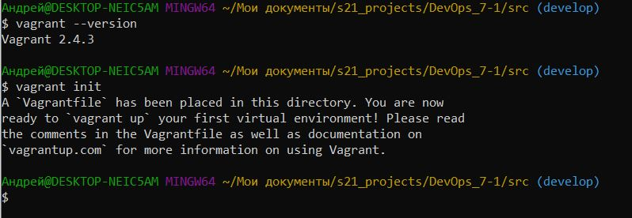

##  Задание
В папке **src/services** находится код микрсервисного приложения, написанного на java. Необходимо, используя различные технологии, собрать и развернуть это приложение и проверить его работу при помощью программы Postman. Описание приожения находися в папке **matirials**.

## Part 1. Запуск нескольких docker-контейнеров с использованием docker compose
В первой части необходимо использовать docker и docker-compose для сборки и развертывания приложения.

### 1.1.1

 Всего в нашем приложении 9 сервисов, для двух из них - базы данных и менеджера сообщений, будут использоваться стандартные контейнеры, например rabbitmq:3-management-alpine, выгрузим его из Docker Hub при помощи команды **docker pull**:


Таким же образом установим образ для базы данных Postgres.

### 1.1.2
 Для сборки и запуска семи остальных частей были написаны Dockerfiles, по структуре они схожи друг с другом, приведу здесь текст Dockerfile для сервиса **report-service**:

```docker
FROM maven:3.8.4-jdk-8 AS build

WORKDIR /app
COPY .mvn .mvn 
COPY pom.xml ./
COPY mvnw ./

RUN mvn -B dependency:go-offline --batch-mode --errors

COPY src ./src
RUN mvn -B package -DskipTests

FROM openjdk:8-jdk-alpine
WORKDIR /app
COPY . .
RUN apk add --no-cache bash
RUN chmod +x wait-for-it.sh
COPY --from=build /app/target/*.jar /app/*.jar
CMD ["./wait-for-it.sh",  "-t", "60", "db:5432", "--",\
     "./wait-for-it.sh",  "-t", "60", "rabbitmq:5672", "--",\
     "java", "-jar", "/app/*.jar"]
```

В данном случае используется multistage сборка, что позволяет уменьшить размер поучившегося образа.
Размеры образов можно посмотреть с помощью команды **docker images**, вот ее вывод:


### 1.2
 Для корректной сборки всех сервисов, а так же взаимодействия сервисов между собой был написан следующий docker-compose файл:

```yaml
version: "3.8"
services:
  rabbitmq:
    image: rabbitmq:3-management-alpine
    ports:
      - "5672:5672"
      - "15672:15672"
    networks:
      - app-network

  db:
    image: postgres:16.2
    restart: always
    networks:
      - app-network
    ports:
      - "5432:5432"
    environment:
      POSTGRES_USER: postgres
      POSTGRES_PASSWORD: "password"
      POSTGRES_DB: postgres
    volumes:
      - ./services/database/init.sql:/docker-entrypoint-initdb.d/init.sql
      - pg_data:/var/lib/postgresql/data
    healthcheck:
      test: >
        bash -c '
        psql -U postgres -d users_db -c "SELECT 1;" &&
        psql -U postgres -d hotels_db -c "SELECT 1;" && 
        psql -U postgres -d balances_db -c "SELECT 1;" &&
        psql -U postgres -d reservations_db -c "SELECT 1;" &&
        psql -U postgres -d payments_db -c "SELECT 1;" &&
        psql -U postgres -d statistics_db -c "SELECT 1;"
        '
      interval: 10s
      timeout: 10s
      retries: 5

  booking-service:
    restart: always
    build: ./services/booking-service/
    networks:
      - app-network
    ports:
      - "8083:8083"
    environment:
      POSTGRES_HOST: db
      POSTGRES_PORT: 5432
      POSTGRES_USER: postgres
      POSTGRES_PASSWORD: "password"
      POSTGRES_DB: reservations_db
      RABBIT_MQ_HOST: rabbitmq
      RABBIT_MQ_PORT: 5672
      RABBIT_MQ_USER: guest
      RABBIT_MQ_PASSWORD: guest
      RABBIT_MQ_QUEUE_NAME: messagequeue
      RABBIT_MQ_EXCHANGE: messagequeue-exchange
      HOTEL_SERVICE_HOST: hotel-service
      HOTEL_SERVICE_PORT: 8082
      PAYMENT_SERVICE_HOST: payment-service
      PAYMENT_SERVICE_PORT: 8084
      LOYALTY_SERVICE_HOST: loyalty-service
      LOYALTY_SERVICE_PORT: 8085
    depends_on:
      db:
        condition: service_healthy
      rabbitmq:
        condition: service_started

  session-service:
    restart: always
    build: ./services/session-service/
    networks:
      - app-network
    ports:
      - "8081:8081"
    environment:
      POSTGRES_HOST: db
      POSTGRES_PORT: 5432
      POSTGRES_USER: postgres
      POSTGRES_PASSWORD: "password"
      POSTGRES_DB: users_db
    depends_on:
      db:
        condition: service_healthy

  hotel-service:
    restart: always
    build: ./services/hotel-service/
    networks:
      - app-network
    ports:
      - "8082:8082"
    environment:
      POSTGRES_HOST: db
      POSTGRES_PORT: 5432
      POSTGRES_USER: postgres
      POSTGRES_PASSWORD: "password"
      POSTGRES_DB: hotels_db
    depends_on:
      db:
        condition: service_healthy

  payment-service:
    restart: always
    build: ./services/payment-service/
    networks:
      - app-network
    ports:
      - "8084:8084"
    environment:
      POSTGRES_HOST: db
      POSTGRES_PORT: 5432
      POSTGRES_USER: postgres
      POSTGRES_PASSWORD: "password"
      POSTGRES_DB: payments_db
    depends_on:
      db:
        condition: service_healthy

  loyalty-service:
    restart: always
    build: ./services/loyalty-service/
    networks:
      - app-network
    ports:
      - "8085:8085"
    environment:
      POSTGRES_HOST: db
      POSTGRES_PORT: 5432
      POSTGRES_USER: postgres
      POSTGRES_PASSWORD: "password"
      POSTGRES_DB: balances_db
    depends_on:
      db:
        condition: service_healthy

  report-service:
    restart: always
    build: ./services/report-service/
    networks:
      - app-network
    ports:
      - "8086:8086"
    environment:
      POSTGRES_HOST: db
      POSTGRES_PORT: 5432
      POSTGRES_USER: postgres
      POSTGRES_PASSWORD: "password"
      POSTGRES_DB: statistics_db
      RABBIT_MQ_HOST: rabbitmq
      RABBIT_MQ_PORT: 5672
      RABBIT_MQ_USER: guest
      RABBIT_MQ_PASSWORD: guest
      RABBIT_MQ_QUEUE_NAME: messagequeue
      RABBIT_MQ_EXCHANGE: messagequeue-exchange
    depends_on:
      db:
        condition: service_healthy
      rabbitmq:
        condition: service_started

  gateway-service:
    restart: always
    build: ./services/gateway-service/
    ports:
      - "8087:8087"
    networks:
      - app-network
    environment:
      SESSION_SERVICE_HOST: session-service
      SESSION_SERVICE_PORT: 8081
      HOTEL_SERVICE_HOST: hotel-service
      HOTEL_SERVICE_PORT: 8082
      BOOKING_SERVICE_HOST: booking-service
      BOOKING_SERVICE_PORT: 8083
      PAYMENT_SERVICE_HOST: payment-service
      PAYMENT_SERVICE_PORT: 8084
      LOYALTY_SERVICE_HOST: loyalty-service
      LOYALTY_SERVICE_PORT: 8085
      REPORT_SERVICE_HOST: report-service
      REPORT_SERVICE_PORT: 8086
    depends_on:
      booking-service:
        condition: service_started
      hotel-service:
        condition: service_started
      session-service:
        condition: service_started
      payment-service:
        condition: service_started
      loyalty-service:
        condition: service_started
      report-service:
        condition: service_started

networks:
  app-network:

volumes:
  pg_data:
```

В нем, для каждого разворачиваемого сервиса были прописаны необходимые зависимости, которые содержатся в папке **materials**.
Для всех сервисов были проброшены необходимые порты с помощью директивы **ports:**.

### 1.3
 Запуск сборки приложения можно осуществить при помощи команды **docker-compose up -d** которая запустит все описанные в docker-compose контейнеры и перейдет в фоновый режим. Для остановки сервисов можно использовать комаду **docker-compose down**. 
 
 В процессе выполнеия этого пункта на локальной машине при помощи виртуальной машины virtualbox возникли непредвиденные трудности: из-за низкой производительности локальной машины виртуальная машина не могла поддерживать одновременное функционирование всех сервисов и они контейнеры рестартовали, соответственно, тестирование с помощью postman не проходило. Для решения этой проблемы было принято решение перенести тестирование приложения в CI/CD пайплайн на базе сервиса GitHub Actions. Был написан workflow файл, создающий необходимую инфраструктуру на github-hosted машине, переносивший туда исходный код приложения и запускающий сбоку с последующим тестированием. В результате этих действий приложение собралось корректно и тесты postman прошли успешно. Этот пайплайн можно посмотреть по ссылке: https://github.com/AndreySyskov/s21_projects/actions/runs/13901046352

### 1.4
Результаты тестирования приложения при помощи программы Postman:

 


## Part 2. Создание виртуальных машин

Во второй части необходимо протестировать работу Vagrant на примере одной виртуальной машины.


### 2.1.1
Выполнение этой части проекта осуществлялось на компьютере под управлением ОС Windows 10. Поскольку компания Hashicorp официально прекратила работу в России, для скачивания установочного файла Vagrant пришлось воспользоваться местным репозиторим, подробности описаны в статья на Хабр: https://habr.com/ru/articles/735700/ там же есть ссылка на необходимый файл. Установка не предполагает никаких сложных действий. Для работы нам так же понадобится установленный Virtualbox.

### 2.1.2
Для инициализации Vagrant перейдем в корень проекта и выполним команду **vagrant init**:

  

### 2.1.3
Напишем Vagrantfile для одной виртуальной машины.

```ruby
ENV['VAGRANT_SERVER_URL'] = 'https://vagrant.elab.pro'

  Vagrant.configure("2") do |config|

    config.vm.box = "ubuntu/jammy64"
    config.vm.synced_folder "../services", "/mnt/services" # смонтировать папку services на хосте в папку на госте
    config.vm.hostname = "worker" 

    config.vm.provider "virtualbox" do |vb|
      vb.name = "worker" 
      vb.memory = "2048"  # 2 ГБ оперативной памяти
      vb.cpus = 1     
    end
   
    config.vm.provision "shell", inline: <<-SHELL

      mkdir -p /home/vagrant/services
      cp -r /mnt/services/* /home/vagrant/services/

    SHELL
  end
```

Для корректной работы файла была добавлена строка 

**ENV['VAGRANT_SERVER_URL'] = 'https://vagrant.elab.pro'**
кототая позволяет скачивать исходные образы виртуальных машин с местного репозитория.

Монтирование папки с исходным кодом приложения осуществляется с помощью директивы **config.vm.synced_folder**.

Поднимем виртуальную машину при помощи команды **vagrant up**:


## 2.2 
Зайдем через консоль внутрь виртуальной машины при помощи команды **vagrant ssh** и удостоверимся, что исходный код встал, куда нужно: 


Остановим и уничтожим виртуальную машину при помощи команд **vagrant halt** и **vagrant destroy**:


## Part 3. Создание простейшего docker swarm

В этом задании приложение необходимо развернуть при помощи docker-swarm, с распределением на трех виртуальных машинах.
Поскольку GitHub Actions не поддерживает вложенную виртуализацию, эта часть проекта выполнялась локально, но на более мощном компьютере iMac.


### 3.1 
Модифицируем Vagrantfile для создания трех машин: manager01, worker01, worker02:
```ruby
ENV['VAGRANT_SERVER_URL'] = 'https://vagrant.elab.pro'


Vagrant.configure("2") do |config|
 config.vm.box = "ubuntu/jammy64"

 config.vm.provision "shell", inline: <<-SHELL
   sudo bash /vagrant/docker-script.sh
 SHELL

 config.vm.define "manager01" do |manager01|
   manager01.vm.hostname = "manager01"
   manager01.vm.network "private_network", ip: "192.168.56.10"
  
   manager01.vm.provider "virtualbox" do |vb|
     vb.name = "manager01"
     vb.memory = "2048"
     vb.cpus = 1
   end


   manager01.vm.provision "shell", inline: <<-SHELL
     sudo bash /vagrant/swarm_init_manager.sh
   SHELL
 end


 config.vm.define "worker01" do |worker01|
   worker01.vm.hostname = "worker01"
   worker01.vm.network "private_network", ip: "192.168.56.11"
  
   worker01.vm.provider "virtualbox" do |vb|
     vb.name = "worker01"
     vb.memory = "2048"
     vb.cpus = 1
   end


   worker01.vm.provision "shell", inline: <<-SHELL
     sudo bash /vagrant/swarm_init_worker.sh
   SHELL
 end


 config.vm.define "worker02" do |worker02|
   worker02.vm.hostname = "worker02"
   worker02.vm.network "private_network", ip: "192.168.56.12"


   worker02.vm.provider "virtualbox" do |vb|
     vb.name = "worker02"
     vb.memory = "2048"
     vb.cpus = 1
   end
   worker02.vm.provision "shell", inline: <<-SHELL
     sudo bash /vagrant/swarm_init_worker.sh
   SHELL
 end
end

```
Напишем shell-скрипты для установки docker внутрь машин, инициализации и подключения к docker swarm:
```bash
#!/bin/bash

      # Обновление пакетов
      sudo apt update

      # Установка зависимостей
      sudo apt install -y apt-transport-https ca-certificates curl software-properties-common

      # Добавление официального GPG-ключа Docker
      curl -fsSL https://download.docker.com/linux/ubuntu/gpg | sudo gpg --dearmor -o /usr/share/keyrings/docker-archive-keyring.gpg

      # Добавление репозитория Docker
      echo "deb [arch=$(dpkg --print-architecture) signed-by=/usr/share/keyrings/docker-archive-keyring.gpg] https://download.docker.com/linux/ubuntu $(lsb_release -cs) stable" | sudo tee /etc/apt/sources.list.d/docker.list > /dev/null

      # Установка Docker
      sudo apt update
      sudo apt install -y docker-ce docker-ce-cli containerd.io

      # Добавление пользователя vagrant в группу docker (чтобы не использовать sudo)
      sudo usermod -aG docker vagrant

      # Включение и запуск Docker
      sudo systemctl enable --now docker
```
Таким образом, при первоначальном запуске виртуальных машин будет сразу установлен docker для того, чтобы можно было развернуть наше приложение.

### 3.2 
Загрузим собранные образы на Docker Hub. Для этого, собранным образам нужно будте присвоить теги, а затем, с помощью команды **docker push** загрузить в репозиторий Docker Hub:

Теперь мы можем забирать уже готовые сконфигурированные образы, которые содержат скомпилированные и готовые к использованию части нашего приложения.

Модифицироуем docker-compose файл для подгрузки расположенных на Docker Hub образов.
```yaml
#version: "3.8"
services:
 rabbitmq:
   image: rabbitmq:3-management-alpine
   ports:
     - "5672:5672"
     - "15672:15672"
   networks:
     - app-network
   deploy:
     replicas: 1


 db:
   image: andreys21/postgres_16_2:1.0
   restart: always
   networks:
     - app-network
   ports:
     - "5432:5432"
   environment:
     POSTGRES_USER: postgres
     POSTGRES_PASSWORD: "password"
     POSTGRES_DB: postgres
   volumes:
    
     - pg_data:/var/lib/postgresql/data
   healthcheck:
     
     test: >
       bash -c '
       psql -U postgres -d users_db -c "SELECT 1;" &&
       psql -U postgres -d hotels_db -c "SELECT 1;" &&
       psql -U postgres -d balances_db -c "SELECT 1;" &&
       psql -U postgres -d reservations_db -c "SELECT 1;" &&
       psql -U postgres -d payments_db -c "SELECT 1;" &&
       psql -U postgres -d statistics_db -c "SELECT 1;"
       '
     interval: 10s
     timeout: 10s
     retries: 10
   deploy:
     replicas: 1


 booking-service:
   restart: always
   image: andreys21/booking-service:latest
   networks:
     - app-network
   ports:
     - "8083:8083"
   environment:
     POSTGRES_HOST: db
     POSTGRES_PORT: 5432
     POSTGRES_USER: postgres
     POSTGRES_PASSWORD: "password"
     POSTGRES_DB: reservations_db
     RABBIT_MQ_HOST: rabbitmq
     RABBIT_MQ_PORT: 5672
     RABBIT_MQ_USER: guest
     RABBIT_MQ_PASSWORD: guest
     RABBIT_MQ_QUEUE_NAME: messagequeue
     RABBIT_MQ_EXCHANGE: messagequeue-exchange
     HOTEL_SERVICE_HOST: hotel-service
     HOTEL_SERVICE_PORT: 8082
     PAYMENT_SERVICE_HOST: payment-service
     PAYMENT_SERVICE_PORT: 8084
     LOYALTY_SERVICE_HOST: loyalty-service
     LOYALTY_SERVICE_PORT: 8085
   depends_on:
     - db
     - rabbitmq
      
   deploy:
     replicas: 1


 session-service:
   restart: always
   image: andreys21/session-service:latest
   networks:
     - app-network
   ports:
     - "8081:8081"
   environment:
     POSTGRES_HOST: db
     POSTGRES_PORT: 5432
     POSTGRES_USER: postgres
     POSTGRES_PASSWORD: "password"
     POSTGRES_DB: users_db
   depends_on:
     - db
        
   deploy:
     replicas: 1


 hotel-service:
   image: andreys21/hotel-service:latest
   restart: always
  
   networks:
     - app-network
   ports:
     - "8082:8082"
   environment:
     POSTGRES_HOST: db
     POSTGRES_PORT: 5432
     POSTGRES_USER: postgres
     POSTGRES_PASSWORD: "password"
     POSTGRES_DB: hotels_db
   depends_on:
     - db
        
   deploy:
     replicas: 1


 payment-service:
   restart: always
   image: andreys21/payment-service:latest
   networks:
     - app-network
   ports:
     - "8084:8084"
   environment:
     POSTGRES_HOST: db
     POSTGRES_PORT: 5432
     POSTGRES_USER: postgres
     POSTGRES_PASSWORD: "password"
     POSTGRES_DB: payments_db
   depends_on:
     - db
      
   deploy:
     replicas: 1


 loyalty-service:
   restart: always
   image: andreys21/loyalty-service:latest
   networks:
     - app-network
   ports:
     - "8085:8085"
   environment:
     POSTGRES_HOST: db
     POSTGRES_PORT: 5432
     POSTGRES_USER: postgres
     POSTGRES_PASSWORD: "password"
     POSTGRES_DB: balances_db
   depends_on:
     - db
     
   deploy:
     replicas: 1


 report-service:
   image: andreys21/report-service:latest
   restart: always
  
   networks:
     - app-network
   ports:
     - "8086:8086"
   environment:
     POSTGRES_HOST: db
     POSTGRES_PORT: 5432
     POSTGRES_USER: postgres
     POSTGRES_PASSWORD: "password"
     POSTGRES_DB: statistics_db
     RABBIT_MQ_HOST: rabbitmq
     RABBIT_MQ_PORT: 5672
     RABBIT_MQ_USER: guest
     RABBIT_MQ_PASSWORD: guest
     RABBIT_MQ_QUEUE_NAME: messagequeue
     RABBIT_MQ_EXCHANGE: messagequeue-exchange
   depends_on:
     - db
     - rabbitmq
        
   deploy:
     replicas: 1


 gateway-service:
   restart: always
   image: andreys21/gateway-service:latest
   ports:
     - "8087:8087"
   networks:
     - app-network
   environment:
     SESSION_SERVICE_HOST: session-service
     SESSION_SERVICE_PORT: 8081
     HOTEL_SERVICE_HOST: hotel-service
     HOTEL_SERVICE_PORT: 8082
     BOOKING_SERVICE_HOST: booking-service
     BOOKING_SERVICE_PORT: 8083
     PAYMENT_SERVICE_HOST: payment-service
     PAYMENT_SERVICE_PORT: 8084
     LOYALTY_SERVICE_HOST: loyalty-service
     LOYALTY_SERVICE_PORT: 8085
     REPORT_SERVICE_HOST: report-service
     REPORT_SERVICE_PORT: 8086
   depends_on:
     - booking-service
     - hotel-service
     - session-service
     - payment-service
     - loyalty-service
     - report-service
   deploy:
     replicas: 1


networks:
 app-network:
   driver: overlay


volumes:
 pg_data:
   driver: local
```
Помимо замены стандартных образов на загруженные на docker hub, потребовалось так же указать, сколько экземпляров каждого сервиса нужно поднимть, это было сделано при помощи конструкции:
```yaml
deploy:
     replicas: 1
```
Так же потребовалость изменить синтаксис в блоке зависимостей **depends_on:**.

### 3.3 
Поднимим виртуальные машины при помощи команды **vagrant up**. При запуске внутрь виртуальных машин автоматически монтируется папка, из которой была запущена команда vagrant up поэтому отдельно переносить docker-compose файл не требуется.
Проверим, что машины запустились командой **vagrant status**
 

Запустим стек сервисов, перейдя внутрь виртуально машины manager01 при помощи команды **vagrant ssh manager01** и используя команду **docker stack deploy -c docker-compose.yml DevOps_app**.
Проверим, что сервисы запущены при помощи команды **docker service ls**


### 3.4 
Настроим прокси на базе nginx для доступа к gateway service и session service по оверлейной сети. 
Для этого добавим в docker-compose файл блок, описывающий, как нам поднять сооветствующий контейнер:
```yaml
nginx:
   image: nginx:1.25.5-alpine
   restart: always
   networks:
     - app-network
   ports:
    - "8081:8081"
    - "8087:8087"
   volumes:
    - ./nginx/nginx.conf:/etc/nginx/nginx.conf:ro
   depends_on:
     - session-service
   deploy:
     replicas: 1
```
При этом, необходимо создать файл конфигурации nginx.conf и прописать там конфигурацию работы прокси-сервера с учетом того, что он может взаимодействовать с несколькими экземплярами запущенных сервисов, это делается при помощи директивы **upstream**:
```nginx
events {}

http {
    upstream session {
        server session-service:8081;
    }

    upstream gateway {
        server gateway-service:8087;
    }

    server {
        listen 8081;

        location / {
            proxy_pass http://session;
        }
    }

    server {
        listen 8087;

        location / {
            proxy_pass http://gateway;
        }
    }
}
```
Сами gateway service и session service сделаем недоступными напрямую, исключив из их конфигурации в docker-compose файле директиву ports.

### 3.5 
Прогоним заготовленные тесты через postman и удостоверься, что все они проходят успешно:


### 3.6 
Используя командe **docker stack ps**, отобразим распределение контейнеров по узлам:


### 3.7 
Установим отдельным стеком Portainer внутри кластера. Для этого напишем конфигурационный yml-файл с описанием конфигурацию:
```yaml
version: '3.8'
services:
  portainer:
    image: portainer/portainer-ce:latest
    command: -H unix:///var/run/docker.sock
    ports:
      - "9443:9443"
    deploy:
      mode: replicated
      replicas: 1
      placement:
        constraints: [node.role == manager]
    volumes:
      - /var/run/docker.sock:/var/run/docker.sock
      - portainer_data:/data
volumes:
  portainer_data:
```
Для того, чтобы получить доступ к HTTPS интерфейсу Portainer, добавим в Vagrantfile проброс порта и перезапустим кластер командой **vagrant reload**. После чего на manager01 еще раз запустим стек сервисов нашего приложеиня и стек portainer.
В браузере получим доступ к интерфейсу по адресу https://localhost:9443/


Распределения задач по узлам с помощью Portainer можно посмотреть во вкладке Swarm, кликнув на **Go to cluster visualizer**:


Если модифицировать docker-compose файл для запуска стека сервисов основной программы и прописать там по 2 реплики каждого сервиса и перезапустить docker swarm, можно в реальном времени наблюдать за поведением каждого контейнера на каждой машине кластера:


